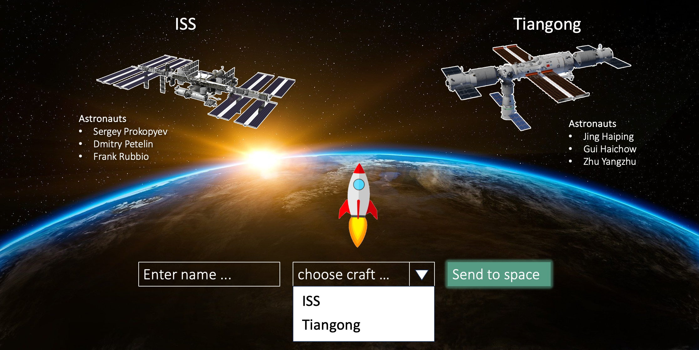

# Prerequisite
* Install node: https://nodejs.org/en/download
* Install VSCode: https://code.visualstudio.com/download (or other IDE)
* Install Svelte plugin: https://marketplace.visualstudio.com/items?itemName=svelte.svelte-vscode (or for your IDE)
    
# Links for more information about svelte
* [Examples](https://svelte.dev/examples/hello-world)
* [Interactive Tutorial](https://learn.svelte.dev/tutorial/welcome-to-svelte)
* [API documentation](https://svelte.dev/docs/introduction)
* [Playground](https://svelte.dev/repl/hello-world?version=4.2.1)

# Challenges

1. Setup Svelte Application
2. Build layout with components
3. Request and display current astronauts in space from API http://api.open-notify.org/astros.json
4. Send new astronauts to space
5. Alert when there are too many astronauts on a craft
6. Animate takeoff of space shuttle




## Creating a project

If you're seeing this, you've probably already done this step. Congrats!

```bash
# create a new project in the current directory
npm create vite@latest

```

## Developing

Once you've created a project and installed dependencies with `npm install` (or `pnpm install` or `yarn`), start a development server:

```bash
npm run dev

# or start the server and open the app in a new browser tab
npm run dev -- --open
```

## Building

To create a production version of your app:

```bash
npm run build
```

You can preview the production build with `npm run preview`.

> To deploy your app, you may need to install an [adapter](https://kit.svelte.dev/docs/adapters) for your target environment.
